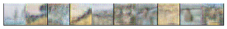

# NZSG-GAN
This code runs a GAN based on the network zero-sum framework (see [paper](https://arxiv.org/pdf/2007.05477.pdf)). The GAN consists of three networks --- a classifer, a discriminator, and a generator. The goal of NZSG-GAN is to train a generator to inteliigently integrate two different styles for image generation.

## Dependencies
* numpy
* matplotlib
* torch
* torchvision
* PIL

## Running Instructions

The script can be run with the following arguments, 

        python nzsg_app.py [-w] [-b] [-e] [-nc] [-ngpu]
        [-ncf] [-ngf]
        [-lr] [-lrC] [-be]

        -w, --workers
        -b, --batch_size
        -e, --epochs
        -nc, --num_classes
        -ngpu, --ngpu
        -ncf, --ncf     size of first convolutional layer for classifier
        -ngf, --ngf     size of first convolutional layer for generator
        -lr, --lr       learning rate for generator and discriminator
        -lrC, --lrC     learning rate for classifier
        -be, --beta     beta1 used by Adam optimizer

## Results

Here is an example of the images output by the net when fed with real images.

